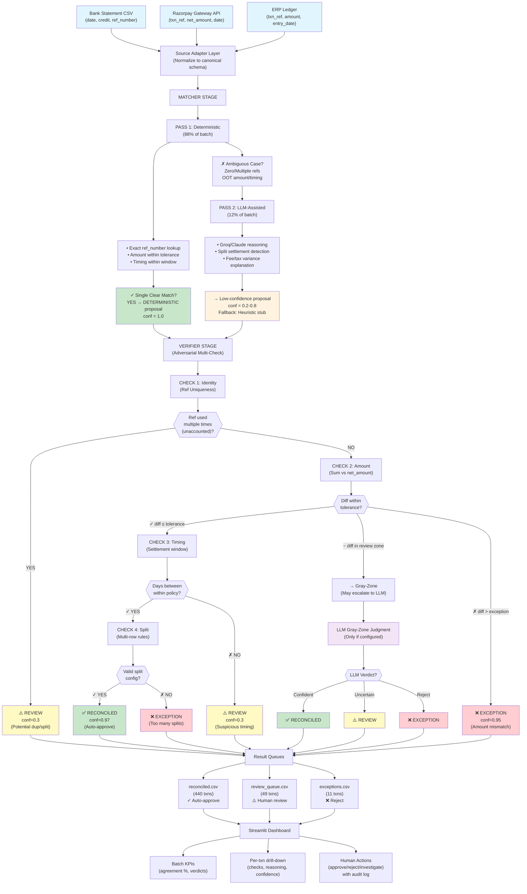
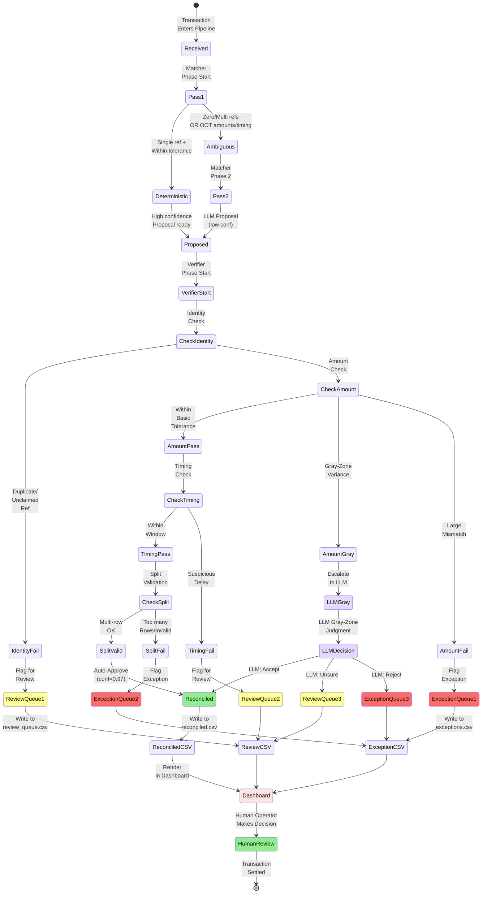
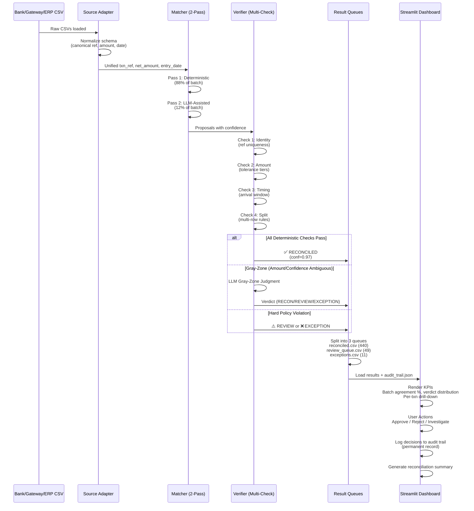
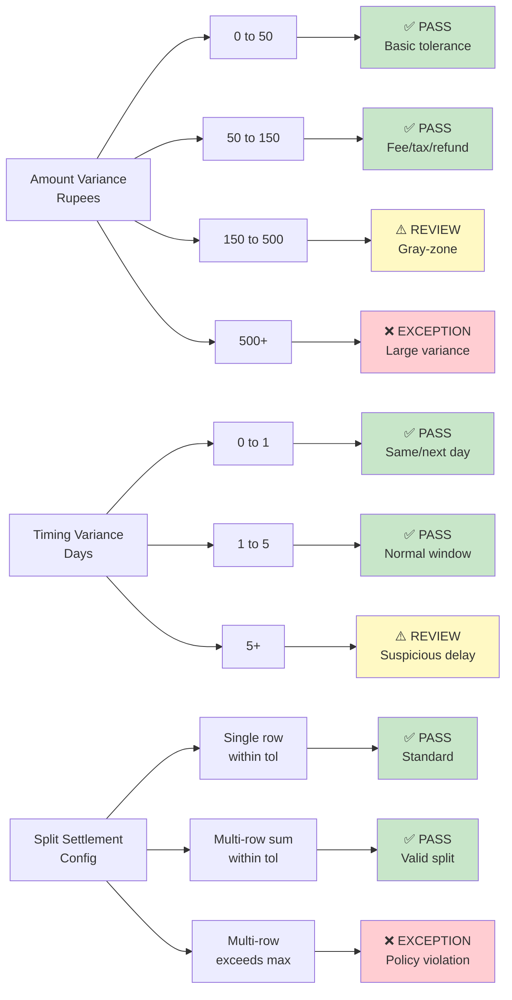

# RazorRecon Finance Control Tower

### Run the books. Protect the cash position.

RazorRecon is an adversarial finance-operations controller built for the Razorpay AI Buildathon. It reconciles bank credits, payment-gateway settlements, and ERP entries across a full transaction batch.


## Why This Matters

The finance-ops bottleneck is not producing a match quickly; it is verifying that the match is safe. RazorRecon uses two separate decision stages:

- **Matcher:** resolves obvious records deterministically using reference, amount, and timing rules, then sends ambiguous cases to LLM reasoning.
- **Verifier:** independently tries to disprove each proposal using policy checks for timing, amount variance, duplicate references, missing settlements, and split settlements.

The system is intentionally conservative: an uncertain transaction goes to a human instead of being silently marked reconciled.

## Track Fit and Measured Result

The included synthetic batch contains **500 transactions** across bank, gateway, and ERP sources, with injected timing mismatches, duplicate references, missing settlements, fee/tax variance, split settlements, and wrong amounts.

| Measure | Result |
| --- | ---: |
| Agreement with hidden ground truth | **500/500 (100%)** |
| Reconciled automatically | 440 |
| Sent for human review | 49 |
| Exceptions | 11 |
| Dangerous false positives | **0** |

This demonstrates the complete finance-ops loop: process a meaningful batch, quantify accuracy, and expose an honest exception list rather than hiding unresolved records.

---

## Architecture Overview

### System Flow Diagram (Mermaid)



---

### Detailed Decision Flowchart

```mermaid
graph TD
    TX["Transaction Received<br/>(ERP ↔ Gateway)"]
    
    TX --> M1["Matcher Pass 1<br/>Deterministic Check"]
    M1 --> REF{{"Exact ref_number<br/>in bank<br/>statement?"}}
    
    REF -->|❌ Zero matches| M2["Matcher Pass 2<br/>LLM-Assisted"]
    REF -->|✓ One match| AMT["Amount Check<br/>(confidence=1.0)"]
    REF -->|⚠️ Multiple| M2
    
    AMT --> AMTC{{"Credit within<br/>tolerance?"}}
    AMTC -->|✓ YES| TIME["Timing Check"]
    AMTC -->|✗ OOT| M2
    
    TIME --> TIMEC{{"Days ≤<br/>max window?"}}
    TIMEC -->|✓ YES| DET["✅ Deterministic<br/>Proposal<br/>conf=1.0"]
    TIMEC -->|✗ OOT| M2
    
    M2 --> LLM_M["LLM Match<br/>(zero/multi/OOT)"]
    LLM_M --> PROP["🔍 Proposal<br/>(conf=0.2-0.8)"]
    DET --> VERIF["VERIFIER<br/>(Trust but Verify)"]
    PROP --> VERIF
    
    VERIF --> VID["Identity Check"]
    VID --> VIDC{{"Ref unused<br/>elsewhere?"}}
    VIDC -->|❌ Dup/split<br/>unclaimed| VR["→ REVIEW<br/>(low conf)"]
    VIDC -->|✓ Clean| VAMT["Amount Check"]
    
    VAMT --> VAMTC{{"Sum within<br/>basic tolerance?"}}
    VAMTC -->|✓ YES| VTIME["Timing Check"]
    VAMTC -->|~ Gray-Zone| GZONE["Gray-Zone<br/>Decision<br/>(flags for LLM)"]
    VAMTC -->|✗ NO| EXC["→ EXCEPTION<br/>(rejected)"]
    
    VTIME --> VTIMEC{{"Arrival<br/>within policy?"}}
    VTIMEC -->|✓ YES| VSPLIT["Split Check"]
    VTIMEC -->|✗ NO| VR
    
    VSPLIT --> VSPLITC{{"Multi-row valid?"}}
    VSPLITC -->|✓ YES| RECON["✅ RECONCILED<br/>(auto-approve)<br/>conf=0.97"]
    VSPLITC -->|✗ NO| EXC
    
    GZONE --> LLMV["LLM Gray-Zone<br/>Judgment"]
    LLMV --> LLMVD{{"LLM says?"}}
    LLMVD -->|Confident| RECON
    LLMVD -->|Unsure| VR
    LLMVD -->|Reject| EXC
    
    RECON --> OUT["📊 Output"]
    VR --> OUT
    EXC --> OUT
    
    OUT --> CSV1["reconciled.csv<br/>✓ 440"]
    OUT --> CSV2["review_queue.csv<br/>⚠️ 49"]
    OUT --> CSV3["exceptions.csv<br/>❌ 11"]
    
    CSV1 --> AUDIT["audit_trail.json<br/>(full reasoning)"]
    CSV2 --> AUDIT
    CSV3 --> AUDIT
    
    AUDIT --> DASH["Dashboard<br/>(Human interface)"]
    DASH --> HUM["Human Reviews<br/>Queue + Makes Decisions<br/>(logged audit trail)"]
    
    style TX fill:#e3f2fd
    style DET fill:#c8e6c9
    style RECON fill:#a5d6a7
    style VR fill:#fff9c4
    style EXC fill:#ffcdd2
    style GZONE fill:#f3e5f5
    style LLMV fill:#f3e5f5
    style HUM fill:#e0f2f1
    style DASH fill:#fce4ec
```



---

### Component State Machine



---

### Data Transformation Pipeline



---

### Policy Tolerance Matrix



---

### System-Level ASCII Reference

```
┌─────────────────────────────────────────────────────────────────────────┐
│                    DATA INGESTION & NORMALIZATION LAYER                 │
├─────────────────────────────────────────────────────────────────────────┤
│                                                                           │
│  Bank Statement CSV          Gateway Settlement API         ERP Ledger   │
│  ├─ date                     ├─ txn_ref (PG txn ID)        ├─ entry_date  │
│  ├─ credit                   ├─ net_amount (after fees)    ├─ txn_ref     │
│  ├─ ref_number               ├─ gateway_settlement_date    ├─ amount      │
│  └─ bank_id (unique)         └─ status (captured/settled)  └─ category    │
│                                                                           │
│                    Source Adapters (CSV / Razorpay API)                 │
│          Normalize → canonical schema → unified txn_ref key              │
│                                                                           │
└──────────────────────────────┬──────────────────────────────────────────┘
                               │
                               ▼
┌─────────────────────────────────────────────────────────────────────────┐
│                     MATCHER STAGE (Two-Pass Strategy)                   │
├─────────────────────────────────────────────────────────────────────────┤
│                                                                           │
│  PASS 1: Deterministic (88%)  │  PASS 2: LLM-Assisted (12%)            │
│  ─────────────────────────────┼────────────────────────────────────     │
│  • Exact ref match            │  • Zero bank rows for ref             │
│  • Amount within tolerance    │  • Multiple bank rows (dup/split)     │
│  • Timing within window       │  • Amount outside tolerance           │
│  • Result: conf=1.0           │  • Timing outside window              │
│                               │  • Result: conf=0.2-0.8 (Groq/stub)   │
│                                                                           │
└──────────────────────────────┬──────────────────────────────────────────┘
                               │ Proposals
                               ▼
┌─────────────────────────────────────────────────────────────────────────┐
│           VERIFIER STAGE (Adversarial Multi-Check Authority)            │
├─────────────────────────────────────────────────────────────────────────┤
│                                                                           │
│  DETERMINISTIC CHECKS (Authoritative):                                  │
│  1. Identity Check    → Ref reused elsewhere unclaimed?                 │
│  2. Amount Check      → Tiers: PASS | GRAY-ZONE | EXCEPTION            │
│  3. Timing Check      → Settlement within policy window?                │
│  4. Split Check       → Multi-row rules & max_split_parts valid?        │
│                                                                           │
│  ESCALATION:                                                             │
│  • All checks pass      → RECONCILED (conf=0.97, auto-approve)          │
│  • Gray-zone amount     → LLM gray-zone judgment (if configured)        │
│  • Hard policy break    → EXCEPTION or REVIEW                           │
│                                                                           │
└──────────────────────────────┬──────────────────────────────────────────┘
                               │
         ┌─────────────────────┼─────────────────────┐
         ▼                     ▼                     ▼
    RECONCILED           REVIEW                EXCEPTION
    (440 txns)          (49 txns)              (11 txns)
         │                 │                       │
         └───────���─────────┼───────────────────────┘
                           ▼
                    ┌──────────────────┐
                    │  Audit Trail     │
                    │  + Dashboard     │
                    │  + Human Loop    │
                    └──────────────────┘
```

---

## What the Dashboard Shows

- Batch-level reconciliation and safety KPIs
- Deterministic versus LLM-assisted resolution breakdown
- Review and exception queues sorted for triage
- Side-by-side Matcher proposal and Verifier decision
- Per-transaction policy checks and reasoning
- Approve, reject, and investigate actions with persisted decisions
- Policy tolerance reference and replay view for demos

## Quick Start

Use the included synthetic 500-transaction batch for a deterministic smoke test:

```powershell
python data\validate_data.py
python agents\pipeline.py --data data\output --policy agents\policy.json --outdir report\output --no-llm
python report\metrics.py --ground-truth data\output\ground_truth.csv --report report\output
```

The expected result is 500/500 agreement with ground truth and zero dangerous false positives.

## Razorpay Test-Mode Integration

Copy `.env.example` to `.env`, then set `RAZORPAY_KEY_ID` and `RAZORPAY_KEY_SECRET` to test-mode credentials from the Razorpay Dashboard. Run:

```powershell
python agents\pipeline.py --source razorpay --policy agents\policy.json --outdir report\output_razorpay --no-llm
```

The adapter fetches captured test-mode payments and maps payment fields into the canonical gateway and ERP rows. Razorpay does not provide the merchant bank statement through this API, so the adapter simulates the bank side from the payment's settlement details.

Razorpay test-mode payments are fetched through the live adapter. Because Razorpay does not expose the merchant bank statement through the Payments API, the demo explicitly simulates the bank side from the payment settlement metadata (amount, date, reference ID).

## Dashboard

```powershell
streamlit run dashboard\app.py
```

Keep API keys in `.env`; never commit that file or paste its contents into a demo or issue.
